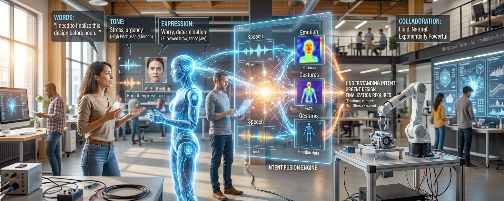

# **Multimodal Intent Fusion: Opening the Door Between Humans and AI**
*Concept Document*

> **Version 2.0 — March 2026**
> Updated to reflect: multimodal architecture and the end of the STT→LLM→TTS pipeline paradigm; the EU AI Act emotion recognition regulatory framework (prohibitions active February 2025, high-risk rules August 2026); state-of-the-art on-device speech models (Whisper-Turbo, Granite-Speech-3.3, Distil-Whisper); MediaPipe Tasks API for on-device vision; and the convergence of edge AI with privacy-first multimodal design.

---

## **1. Introduction: The Closed Door Problem**

Modern AI systems are extraordinarily capable, yet the way humans communicate with them remains surprisingly primitive. Most interactions still rely on typed text prompts — the digital equivalent of sliding handwritten notes under a closed door. The AI on the other side is powerful, but it only sees the words, not the human behind them.

No tone.
No gesture.
No emotional nuance.
No natural flow.

This mismatch between human expression and machine input is becoming a major bottleneck. People do not naturally speak in clean, structured prompts. Spoken language is messy, incomplete, and full of implicit context. Voice-to-text tools capture the words but lose the meaning. And expecting humans to "talk like prompt engineers" is as unnatural as asking them to speak in SQL.

If AI is to collaborate with humans at its full potential, the door must be opened.

---

## **2. The Vision: Opening the Door**

Imagine an interface where AI doesn't just receive words — it receives intent.
Where it understands not only what was said, but what was meant.
Where it hears tone, notices emphasis, and interprets gestures.

This is the vision behind **Multimodal Intent Fusion**:
a communication layer that allows humans to express themselves naturally, while the system interprets and restructures that expression into a clear, precise, machine-ready instruction.

This is not dictation.
This is not rephrasing.
This is a new interface paradigm — a way for humans and AI to communicate in a direct, natural, and complete way.

The key architectural choice: intent fusion happens **before** the AI, not inside it. This makes the layer model-agnostic and applicable to any downstream AI system, tool, or agentic framework — regardless of whether the receiving system supports multimodal input natively.

---

## **3. Why This Matters Now (March 2026)**

AI capability has advanced dramatically, but the interface has not kept pace in tooling and infrastructure. Three forces make this the right moment:

### **1. End-to-end multimodal models exist — but aren't universally accessible.**
Modern AI models can processes audio, vision, and text in a single neural network. Can hear tone and emotion directly — without transcription as an intermediary. But this capability is cloud-only, API-gated, and not portable to local or embedded deployments. The vast majority of AI tools, enterprise systems, agentic frameworks, and embedded devices still receive text. A universal intent compilation layer that works regardless of the receiving system's modality support is still missing.

### **2. Voice interfaces still treat speech as text.**
Even in 2026, most voice pipelines follow the STT→LLM→TTS cascade: transcribe, then reason, then speak. The cascade discards prosodic and paralinguistic signals. The model that reasons never hears the original audio. Anger, urgency, hesitation, enthusiasm — gone at the transcription step.

### **3. On-device multimodal AI has become practical.**
Apple Neural Engine, Qualcomm AI Engine, Google Edge TPU, and NVIDIA Jetson have made on-device speech and vision inference viable at low latency. Quantized Whisper variants (Distil-Whisper, Whisper-Turbo) run on consumer hardware. MediaPipe Tasks provides cross-platform face landmark detection, gesture recognition, and pose estimation without cloud calls. The technical foundation for a privacy-first, local intent compiler now exists.

The timing is right for a communication layer that bridges human expression and machine understanding — universally, locally, and with regulatory clarity about what it can and cannot do.

---

## **4. The Core Concept: The Intent Compiler**

At the center of this idea is a simple but powerful concept:

### **A compiler for human expression.**

Just as a programming language compiler turns messy human code into structured machine instructions, the Intent Compiler turns messy human speech into structured, explicit, intent-aligned prompts.

It is a **best-effort system**, not a psychological probe.
Its goal is to improve communication efficiency, not decode the user's subconscious.
Humans do not always understand each other perfectly — and that is acceptable.
The aim is to be more human-like, not omniscient.

The compiler works in layers.

---

### **4.1 Text Interpretation Layer**

This foundational layer takes raw spoken language — full of filler, half-sentences, and vague references — and transforms it into a clean, coherent instruction.

It handles:
- removing filler words
- resolving ambiguous references
- inferring missing structure
- clarifying goals
- normalizing style

This alone dramatically improves voice-based AI interactions, and is the only layer that is always active.

**2026 implementation note**: Whisper-Turbo (low-latency streaming) and Distil-Whisper are the recommended local ASR choices. IBM's Granite-Speech-3.3 leads accuracy benchmarks for clean speech at 8.18% WER. For resource-constrained edge deployments, Vosk runs entirely offline with no cloud dependency. All of these can be combined with a small local LLM (8B+) for intent restructuring.

---

### **4.2 Prosody & Tone Layer**

Humans encode meaning in how they speak, not just what they say. Tone, pitch, volume, speed, emphasis, and hesitation all carry semantic weight.

These signals are treated as **hints**, not absolute truths, and are incorporated with confidence scoring. The system uses these cues to refine the compiled instruction while remaining conservative in interpretation.

Examples:
- "YES!" → enthusiasm or urgency signal → raise priority framing
- "no…" → hesitation signal → flag ambiguity, offer confirmation
- Sharp pace increase → urgency signal → compress output, add time framing

**2026 implementation note**: Whisper embeddings have been shown to encode prosodic information usefully for downstream SER (Speech Emotion Recognition) tasks — the same model that transcribes can serve as the feature extractor for tonal signals, avoiding a separate audio processing pipeline.

---

### **4.3 Visual Understanding Layer (Optional)**

Facial expressions, gestures, and posture enrich communication. This layer is:
- optional
- consent-based
- ephemeral (never stored)
- never used for anything except immediate intent interpretation
- **disabled by default** in contexts that trigger EU AI Act high-risk classification

A raised eyebrow may signal doubt.
A hand gesture may signal emphasis.
A headshake may signal negation.

These cues help the system produce a more accurate representation of intent.

**2026 implementation note**: MediaPipe Tasks API provides on-device face landmark detection, hand gesture recognition, and pose estimation across Android, iOS, web, and Python — all running locally without cloud calls. This is the recommended implementation path for the visual layer, as it avoids both the latency and the regulatory surface of cloud vision APIs for biometric signals.

**Critical regulatory note**: See Section 5 (Privacy & Consent Model) and Section 9 (EU AI Act Compliance) for constraints on this layer. In the EU, any system that infers emotions from biometric data (including facial expressions) is classified as an emotion recognition system under Article 3(39) of the AI Act, with specific obligations and prohibited contexts active from February 2025.

---

### **4.4 Intent Fusion Layer**

This layer merges all available signals — text, tone, expression, gesture — into a unified semantic representation of what the user meant.

The output is a clean, explicit, prompt-ready instruction that reflects the full human signal, not just the words.

**Design invariant**: The fused intent is always shown to the user before being sent to any downstream AI system. The user can correct, override, or revert to literal transcription at any time. The system never silently acts on its interpretation.

---

## **5. Privacy & Consent Model**

A system of this nature must be built on trust. This is not optional — it is the minimum viable safety posture for adoption in consumer, enterprise, and embedded contexts.

### **Non-negotiable principles**

- **No data retention.** No audio, video, or text is stored unless the user explicitly chooses to save something. Processing is stateless.
- **No secondary use.** User data is never used for training, analytics, profiling, or any purpose other than the immediate intent compilation request.
- **Local processing by default.** Audio and video signals are processed on-device. The only data that leaves the device is the compiled text intent, if the user approves it.
- **Granular permissions.** Users independently enable/disable each modality layer. Text-only is always the minimal mode.
- **Clear active indicators.** Users always see unambiguous visual/audio indicators when microphone or camera is active.
- **Consent is per-session, not persistent.** No "always on" modes without explicit re-confirmation.

### **The compiled intent is not biometric data**

The output of the system — a restructured text prompt — is not personal data under GDPR or biometric data under the EU AI Act. The audio and video signals that produced it are processed ephemerally and discarded. This architectural choice is intentional: it minimizes the regulatory surface of the system while preserving its utility.

---

## **6. User Experience: From Notes to Conversation**

### **Before (Closed Door)**

User speaks:
> *"Uh yeah, can you, like, make that thing… you know… better? And maybe add the dog example?"*

The AI receives a messy text string and must guess the intent. Tone (enthusiasm about "dog example"), hesitation (on "better"), and implicit reference ("that thing" = previous output) are all lost.

### **After (Door Open)**

The system hears the words, detects rising energy on "dog example," notes a brief hesitation around "better" (signaling uncertainty about what improvement means), and produces:

> *"Rewrite the previous summary with higher energy. Include the dog example. Note: 'better' was ambiguous — interpreted as 'more engaging tone'. Confirm or specify."*

The user speaks naturally.
The system interprets precisely.
The AI responds intelligently.
The user can correct before anything is sent.

### **Correction UI (Required)**

The compiled intent is always shown as an editable field. Users have three options:
- **Approve** → send as compiled
- **Edit** → modify the compiled intent before sending
- **Literal** → send the raw transcription instead

This transparency is not a UX nicety — it is required for trust and is the mechanism that keeps the system from becoming an opaque proxy.

---

## **7. Implementation Roadmap**

A phased approach ensures value at every stage. Each phase delivers standalone value and does not require subsequent phases.

### **Phase 1 — Text-Only Intent Compiler (MVP)**
- Speech-to-text (local, Whisper-Turbo or Distil-Whisper)
- Intent inference and prompt restructuring (local LLM, 8B+)
- Compiled intent shown to user before submission
- Works in any text box via browser extension or OS-level IME
- No camera, no emotion analysis, no cloud

**Regulatory status**: No EU AI Act implications. Pure NLP.

### **Phase 2 — Prosody & Tone Integration**
- Paralinguistic feature extraction from audio (pitch, energy, tempo, hesitation)
- Whisper embedding reuse for efficient SER signal extraction
- Lightweight local inference for tonal classification
- Confidence-scored hints integrated into compiled output

**Regulatory status**: Audio processing of the user's own voice, no biometric inference stored. Low regulatory surface.

### **Phase 3 — Visual Signal Integration**
- MediaPipe Tasks for on-device face landmark + gesture detection
- Ephemeral signal processing, zero retention
- Optional layer, off by default, consent-gated
- Disabled automatically in EU workplace/education contexts

**Regulatory status**: Triggers EU AI Act emotion recognition classification in certain contexts (see Section 9). Requires user notification under Article 50. High-risk compliance required if deployed in regulated categories.

### **Phase 4 — Full Multimodal Intent Fusion Engine**
- Unified semantic representation across all modalities
- Open API for any downstream AI tool, agent, or device
- New standard for human-AI communication input
- Embedded deployments (robotics, smart devices, AR/VR)

---

## **8. Use Cases & Impact**

### **Agentic systems**
Agents receive structured intent instead of ambiguous natural language. This reduces hallucination, improves task decomposition, and makes multi-step agentic chains more reliable. Intent compilation is the human-to-agent boundary layer — the point where messy human expression becomes machine-actionable structure.

### **Robotics**
Robots can interpret natural human commands combining speech, gesture, and tone. A technician who says "move that — no, wait, the *other* one, carefully" conveys spatial reference (gesture), correction (pause + "wait"), and handling instruction (tone + "carefully") that text alone cannot capture.

### **Smart devices**
A coffee machine asking "Sugar and milk?" can interpret a half-asleep mumble — filler words, low energy, incomplete sentence — into a precise instruction. The prosody carries as much information as the words.

### **AR/VR interfaces**
Gesture + voice + gaze enables natural control without controllers. Intent fusion is the natural input paradigm for spatial computing.

### **Accessibility**
Users with speech or motor challenges benefit from intent-based interpretation. The system compensates for input irregularity rather than treating it as noise. This is one of the highest-impact applications and directly aligns with EU AI Act accessibility considerations.

### **Everyday AI productivity**
Clearer communication with AI tools, assistants, and automation systems. Less time re-prompting, fewer misunderstandings, more natural interaction.

---

## **9. EU AI Act Compliance**

This section is new in v2.0 and is essential reading for any European deployment.

### **What is regulated**

The EU AI Act defines an **emotion recognition system** (Article 3(39)) as any AI system that identifies or infers emotions or intentions based on biometric data. The European Commission has confirmed this includes facial expressions, body language, and tone/pace of voice — all behavioural biometric data.

This definition covers Phase 3 (Visual Signal Integration) and portions of Phase 2 (Prosody & Tone Integration) of this system, when those signals are used to infer emotional state.

### **The prohibition (active February 2, 2025)**

Emotion recognition systems are **prohibited** in:
- Workplace settings
- Educational institutions

Exceptions exist only for strictly medical or safety purposes (e.g., fatigue detection for pilots or drivers).

**Practical implication**: Phase 3 of this system must be disabled by default in any workplace or educational deployment in the EU. This is a hard architectural requirement, not a preference. Violations carry fines up to €35 million or 7% of global annual turnover.

### **High-risk classification (rules active August 2, 2026)**

In all other permitted contexts, emotion recognition systems are classified as **high-risk** under Annex III. High-risk obligations include:

- Risk management system documentation
- Data governance and quality controls
- Technical documentation and logging
- Human oversight mechanisms
- Conformity assessment before deployment
- Registration in the EU AI Office database

### **Article 50 transparency obligation (active August 2, 2026)**

Deployers of emotion recognition systems must inform users of the system's operation. This maps directly to the consent UI required by this system's design — the obligation is met by the active indicator and per-session consent mechanism already specified in Section 5.

### **What is NOT regulated**

- **Phase 1 (text intent compilation)**: Not an AI system under the AI Act definition that triggers emotion recognition rules. Pure NLP on text.
- **Phase 2 (prosody)**: The Act's Recital 44 clarifies that detecting readily apparent states (e.g., fatigue for safety) is distinct from inferring emotions. A conservative interpretation of prosody that avoids emotion inference labels and limits itself to tonal urgency/emphasis signals may fall below the regulation's threshold. Legal review is recommended before EU deployment of Phase 2.
- **Sentiment analysis on text**: Explicitly excluded from the emotion recognition definition if it relies solely on text and not biometric data.

### **Recommended EU deployment posture**

| Phase | Default in EU | Workplace/Education EU |
|-------|---------------|----------------------|
| Phase 1 (text) | Enabled | Enabled |
| Phase 2 (prosody) | Enabled with conservative framing | Legal review required |
| Phase 3 (visual) | Consent-gated, high-risk compliance required | **Prohibited** |

---

## **10. Technical Architecture**

### **Processing pipeline**

```
[User input]
    ↓
[Modality capture — local only]
    Audio: Microphone → Whisper-Turbo / Distil-Whisper
    Video: Webcam → MediaPipe Tasks (optional, consent-gated)
    ↓
[Signal processing — on-device]
    Text: ASR transcript
    Prosody: Whisper embeddings → tonal classification (pitch, energy, hesitation)
    Visual: MediaPipe face landmarks + gesture classification (ephemeral)
    ↓
[Intent Fusion — local LLM (8B+)]
    Input: transcript + tonal hints + visual hints (if active)
    Output: compiled intent with confidence scores
    ↓
[User review — mandatory UI step]
    Show compiled intent
    User: Approve / Edit / Literal
    ↓
[Output to downstream system]
    Clean text prompt → any AI tool, agent, or device
    No audio, video, or biometric data transmitted
```

### **Latency targets**

| Stage | Target (p95) | Notes |
|-------|-------------|-------|
| ASR (Whisper-Turbo, local) | <500ms for 5s audio | GPU-accelerated |
| Prosody extraction | <100ms | Whisper embedding reuse |
| Visual signal (MediaPipe) | <50ms per frame | On-device, no cloud |
| Intent compilation (8B LLM) | <2s | GPU-accelerated, quantized |
| Total end-to-end | <3s | Acceptable for conversational UX |

---

## **11. Prior Art & Positioning**

### **What exists**

The research community has explored multimodal intent recognition extensively. As of 2025, over 40% of published multimodal emotion recognition papers use trimodal or transformer-based cross-modal fusion architectures. The field is technically mature in narrow domains:

- robotics and human-robot interaction
- dialog systems
- multimodal sentiment analysis
- clinical emotion monitoring

End-to-end models demonstrate that native multimodal understanding is possible at scale. Hume AI, ElevenLabs, and others have built voice-to-voice experiences with emotional expressiveness.

### **What is missing**

None of these provide:
- A **universal, model-agnostic intent compiler** that works across all downstream AI systems
- **Output as structured natural language** (not an emotion label, not a sentiment score — a ready-to-use prompt)
- **OS-level or cross-application integration** that works in any text box
- **Privacy-first local processing** with zero retention as the architectural default
- **Regulatory-aware design** with EU AI Act compliance built in from the start

This is the underexploited opportunity. The research community has solved the signal processing problem. The interface layer — the compiler that bridges messy human expression and structured machine input — remains unbuilt as a universal, deployable system.

---

# **Critic's Appendix: Realities, Risks, and Design Constraints**

---

## **A. The Competitive Landscape Has Changed Since v1.0**

End-to-end audio processing means that for cloud-based deployments using APIs, some of the problem this system solves is already partially addressed at the model level. Advanced Voice Modes processes audio directly, preserving tone and emotion without text transcription as an intermediary.

**Why Multimodal Intent Fusion still matters:**

- Most enterprise AI tools receive text. The intent compiler is the translation layer.
- The compiled intent is model-agnostic — it improves communication with any downstream system.
- The visual modality (gesture, expression) is not handled by audio-only voice modes.
- The correction UI (mandatory human review of compiled intent) is an additional trust and accuracy mechanism that native model processing does not provide.

---

## **B. Emotional and Visual Signals Are Noisy and Culturally Variable**

Tone and expression vary across cultures, individuals, contexts, and physical conditions. A 2025 meta-review found that audio-visual fusion combinations still dominate the field, with trimodal accuracy improvements plateauing in cross-cultural generalization.

The EU AI Act's Recital 44 explicitly notes that emotion recognition systems may "lead to discriminatory outcomes" due to "limited reliability." This is not just a regulatory concern — it is an accuracy concern.

**Design response**: Signals must be treated as probabilistic hints with explicit confidence scoring, never as ground truth. The compiled output must show the uncertainty. The user correction UI is the safety valve.

---

## **C. Multimodal Fusion Latency Is a Real Constraint**

End-to-end multimodal compilation needs to feel responsive. A 3-second total latency is acceptable for a deliberate "submit to AI" action but would feel broken in a conversational flow. Phase 1 (text only) achieves sub-second compilation. Phase 3 (full multimodal) needs careful latency engineering to remain usable.

Practical optimization path: run ASR and visual processing in parallel, not sequentially. The intent LLM receives all signals together rather than waiting for each pipeline to complete.

---

## **D. The MVP Must Be Narrow and Practical**

Phase 1 (text-only intent compiler) is the correct MVP:
- Immediate value with no regulatory exposure
- Works everywhere — any text box, any AI system
- Demonstrates the core compiler concept
- No camera, no emotion model, no compliance complexity

Phase 3 adds value but also adds regulatory, latency, and UX complexity. It should follow Phase 1 by a significant margin.

---

## **E. The Real Innovation Is the Interface Layer**

The research community has explored multimodal intent recognition for years in narrow contexts. What is missing is a universal, OS-level intent compiler that:

- outputs structured natural language (not a classification label)
- works across all applications
- respects privacy architecturally (not just policy)
- handles everyday human messiness
- is EU AI Act compliant by design

This is the gap. This is the innovation.

---

# **Experiments: Current Implementation**

## **⚠️ Disclaimer: Proof-of-Concept, Not Production-Ready**

This is an **experimental implementation** demonstrating the core concepts of Multimodal Intent Fusion. It is **not a full-featured product** and should be treated as a research prototype.

---

## **What This Implementation Does**

The current codebase demonstrates a working pipeline that:

1. **Captures multimodal input** from the user:
   - **Speech** → Transcribed to text using `faster-whisper` (local, no cloud)
   - **Prosody** → Analyzes pitch, energy, and tempo using `librosa`
   - **Facial signals** → Detects facial expressions using `deepface` (optional, consent-gated)
   - **Gestures** → Recognizes hand shapes using MediaPipe Tasks (preferred) or OpenCV fallback

2. **Analyzes tonal context**:
   - Combines audio prosody features with facial expression signals
   - Classifies tonal hints: energetic, hesitant, urgent, flat, neutral
   - Assigns confidence scores to each detection

3. **Compiles intent** using a local LLM:
   - Takes messy spoken input + tonal context
   - Uses a local LLM (llama.cpp or Ollama, 8B+ recommended) to clean and restructure the prompt
   - Integrates tonal framing into the output — baked in, not appended as metadata
   - Shows the compiled intent to the user before any submission

4. **Provides an interactive demo** (`examples/interactive_demo.py`):
   - Real-time capture from microphone and optional webcam
   - Live display of all detected signals with confidence scores
   - Shows the compiled intent with tonal context integrated
   - Provides edit/approve/literal correction options

---

## **How to Run the Experiment**

### **Prerequisites**
- Python 3.10+
- Microphone required; webcam optional (Phase 3 features)
- Local LLM server running (llama.cpp or Ollama)
- GPU recommended for acceptable latency; CPU-only mode available but slow

### **Setup**
```bash
# Install dependencies
pip install -r requirements.txt

# Start a local LLM server (example with llama.cpp)
# 8B+ models recommended: Llama 3.1 8B, Mistral 7B, DeepSeek-R1 8B
./llama-server.exe -m "path/to/model.gguf" --port 8082 -c 4096 -ngl 99
```

### **Run the Interactive Demo**
```bash
python examples/interactive_demo.py
```

The demo will:
- Prompt you to press ENTER to start recording
- Capture 5 seconds of audio + optional video (if webcam enabled)
- Display detected tonal signals and gesture hints with confidence scores
- Show the compiled intent — **you review and approve before anything is sent**

---

## **What's NOT Implemented**

- ❌ Persistent storage of audio/video (intentional — architectural privacy choice)
- ❌ Training on user data (intentional — architectural privacy choice)
- ❌ Advanced gesture vocabulary (only basic shapes)
- ❌ Full correction UI (approve/edit/literal — CLI only currently)
- ❌ Context-aware EU AI Act compliance (auto-disable visual layer in workplace/education)
- ❌ Multi-language support
- ❌ Production-grade error handling
- ❌ Comprehensive testing suite

---

## **Next Steps for Production**

To move this toward production requires work in three areas:

**Signal quality**
1. Replace librosa prosody with Whisper embedding-based SER for tonal classification
2. Replace DeepFace with MediaPipe Tasks for on-device, lower-latency facial signals
3. Implement proper MediaPipe Tasks gesture recognition (not OpenCV fallback)
4. Latency optimization: parallel pipeline execution, quantized models, GPU acceleration

**Interface and trust**
5. Build full correction UI (approve/edit/literal) as the mandatory review step
6. Implement confidence indicators in the compiled output display
7. Add per-session consent flows for each modality layer
8. Add active recording indicators (mic/camera state always visible)

**Compliance and deployment**
9. Implement context detection for EU AI Act compliance (auto-disable visual layer in workplace/education)
10. Add proper documentation for high-risk deployment requirements
11. Comprehensive testing: unit, integration, latency benchmarks, user studies

---

## **Running Tests**

```bash
# Run all tests
python -m pytest tests/ -v

# Run specific test
python -m pytest tests/test_multimodal.py -v
```

---

## **Contributing**

This is an experimental project. If you want to improve it:

1. Fork the repository
2. Create a feature branch
3. Make your changes
4. Run tests to ensure nothing breaks
5. Submit a pull request

Priority contributions: MediaPipe Tasks integration, correction UI, Whisper embedding-based prosody SER, EU context detection.

---

## **License**

MIT License — See LICENSE file for details.

---

# **Conclusion: The Door Opens**

For years, humans have interacted with AI by passing notes under a door.
The intelligence on the other side has grown exponentially, but the door has remained shut.

Multimodal Intent Fusion opens that door.

When AI can understand humans through words, tone, expression, and gesture — and when humans always see and can correct what the system interpreted — collaboration becomes natural, fluid, and exponentially more powerful.

The key insight of this project is architectural: the intent compiler lives **between** human and AI, not inside either. It is model-agnostic, application-agnostic, and device-agnostic. It makes every downstream AI system better by improving the quality of its input.

This is not just a UX improvement.
It is the next interface paradigm.
It is the beginning of direct, natural, complete human-AI communication.

The technical foundation exists.
The regulatory landscape is known.
The door is ready to open.
The hinge now needs to be built.